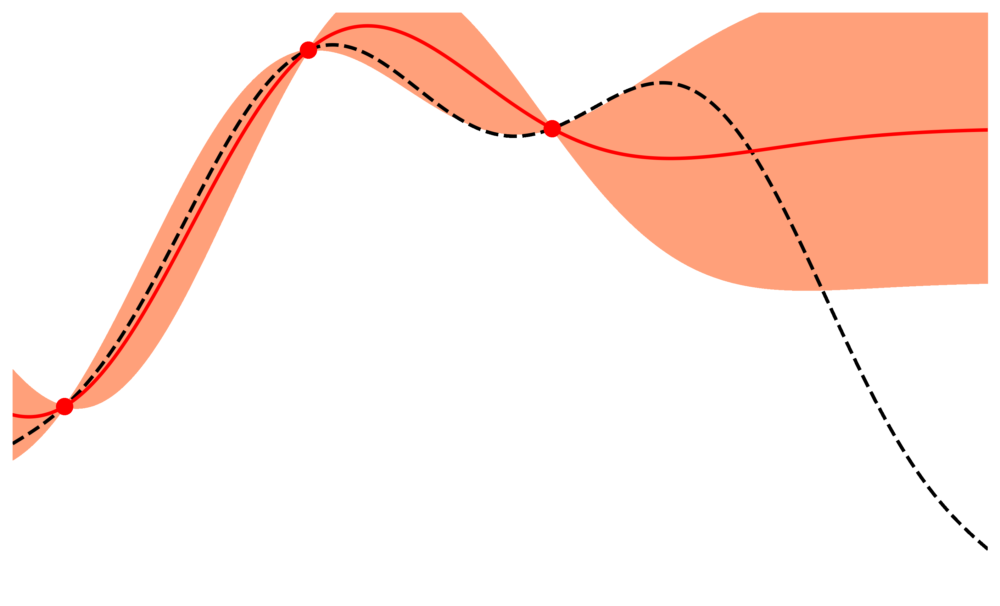

```{toctree}
:caption: Intro
:hidden:

0_installation
1_quickstart
2_save_reload
3_gp_tutorial
4_mcmc_tutorial
5_plot_bayesian_optimization
6_auto_hp_settings
```

```{toctree}
:caption: Benchmark Examples
:hidden:

7_plot_demo_1d
8_plot_demo_2d
9_plot_line_fit
10_plot_kl_divergence
11_plot_gaussian_nd
```

```{toctree}
:caption: Applications
:hidden:

trappist_stellar_evolution
```

```{toctree}
:caption: API
:hidden:

modules
```

```{toctree}
:caption: Development
:hidden:

GitHub Repository <https://github.com/jbirky/alabi>
License <https://github.com/jbirky/alabi/LICENSE>
Issues <https://github.com/jbirky/alabi/issues>
```

# ``alabi``

## Active Learning Accelerated Bayesian Inference 

A python package for performing bayesian inference and optimization for computationally expensive functions.



### Contributors:

- [Jess Birky](https://github.com/jbirky)
- [Rory Barnes](https://github.com/RoryBarnes)
- [David Fleming](https://github.com/dflemin3)